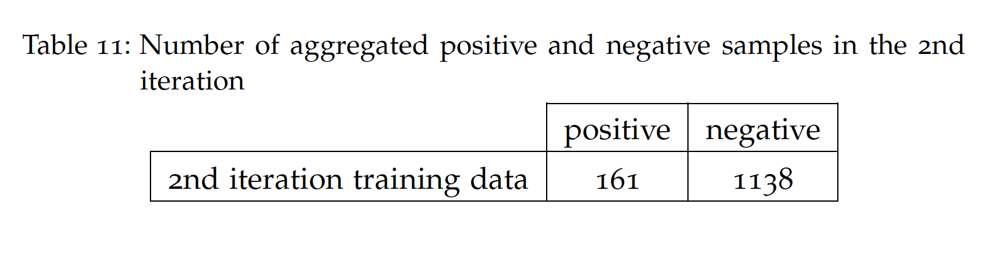

# AID4HAI
Automatic Idea Detection for controlling Healthcare Associated Infections

# Code
Please extract tweets' text using tweets' ID and add it to the dataframe before running this code

The code is based on RoBERTa model from Huggingface’s transformers library. https://huggingface.co/docs/transformers/model_doc/roberta

For more information on how to install the required libraries, please visit: https://towardsdatascience.com/tensorflow-and-transformers-df6fceaf57cc

The following picture demostrates the architecture of the model:

# Dataset

AID4HAI dataset is a collection of Tweets related to Controling Healthcare-Associated Infections.

AC and BC in the file names refere to tweets extracted after and before covid pandemic.

Each tweet is labeled by three anotators indicating whether it includes an idea about Control Healthcare-Associated Infections or not.

Tweets suggesting an idea are marked by 1 others by label 0.

Before using this dataset you need to extract the tweet's text using  Twitter developer account.

An easy way to extract the tweets information is to place it at the end of the following link: https://twitter.com/bramus/status/<twitter_id> e.g. https://twitter.com/bramus/status/932586791953158144

# Conclusion

Following is a list of automatically extracted ideas related to HAI from twitter:

# Citation
If you are using the code or the data shared in this repository, please cite the following paper:

Link to the Thesis 
Link to the published paper
